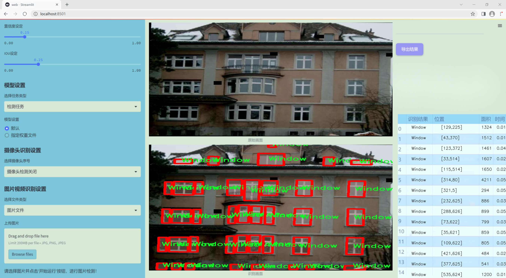
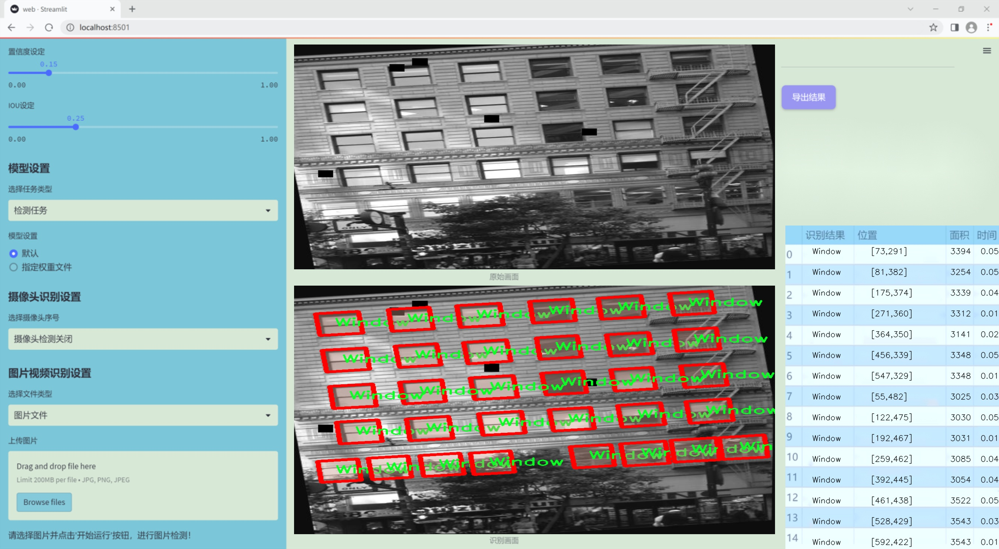
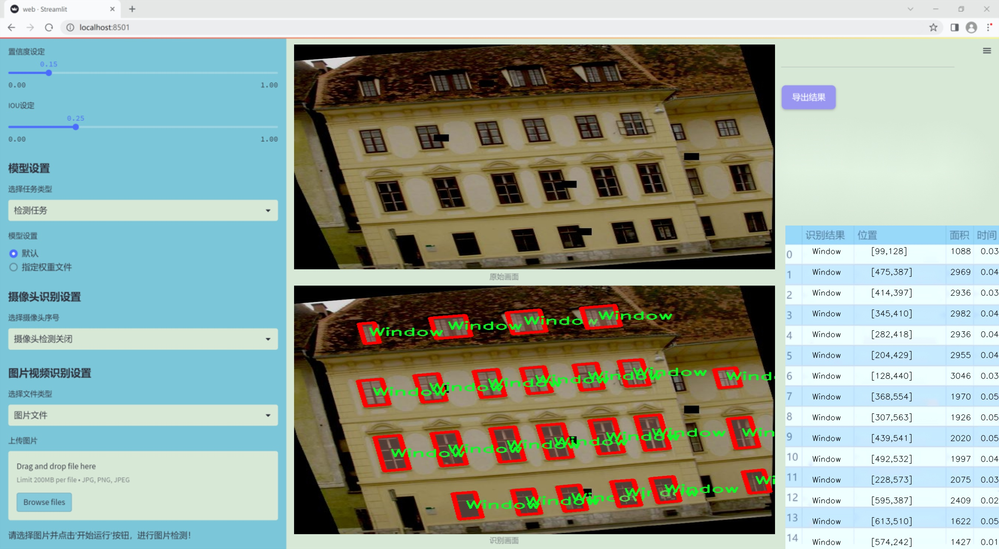
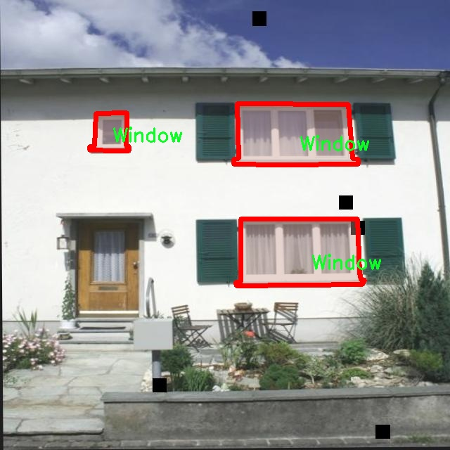
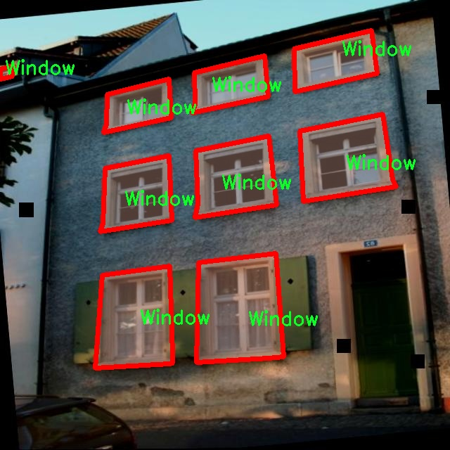
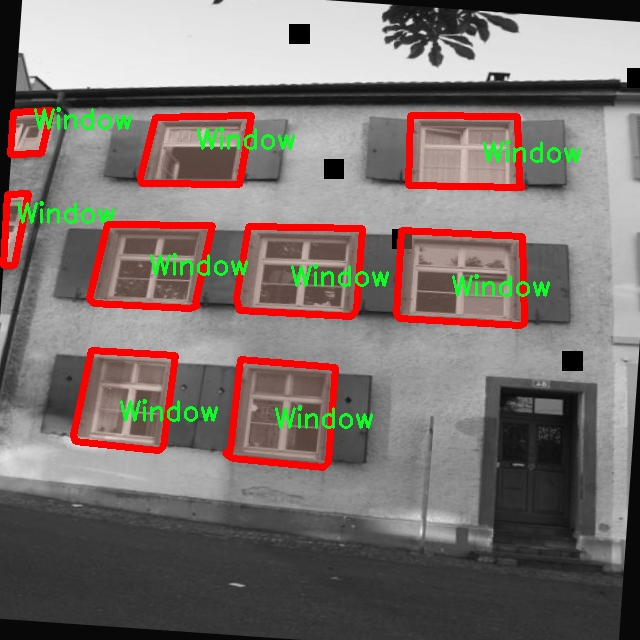
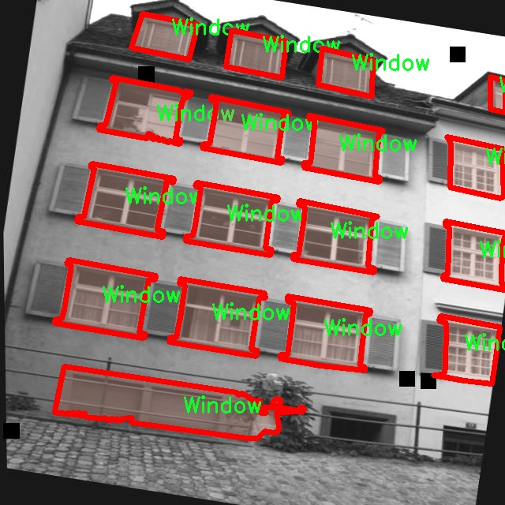
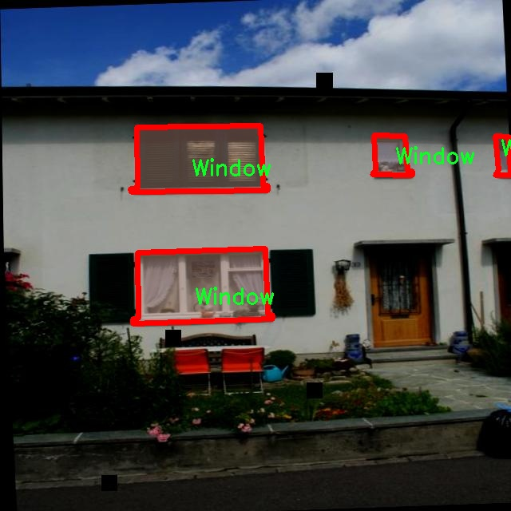

### 1.背景意义

研究背景与意义

随着智能建筑和城市规划的快速发展，窗户作为建筑外立面的重要组成部分，其实例分割技术在建筑物的自动识别、监测和维护中扮演着越来越重要的角色。窗户实例分割不仅可以帮助建筑设计师和工程师更好地理解建筑物的结构特征，还可以为智能城市管理提供数据支持，提升城市的管理效率和可持续发展能力。在这一背景下，基于改进YOLOv11的窗户实例分割系统应运而生，旨在提高窗户识别的准确性和效率。

本研究采用的窗户实例分割数据集包含1300幅图像，涵盖了三类窗户相关的实例：窗户、木材（madeira）和裂缝（rachadura）。这些类别的划分不仅反映了窗户本身的多样性，还考虑到了窗户周边材料及其可能存在的损坏情况。这种细致的分类为后续的实例分割模型训练提供了丰富的样本，有助于提升模型的泛化能力和实用性。

在现有的实例分割技术中，YOLO系列模型因其高效的实时检测能力而受到广泛关注。通过对YOLOv11进行改进，我们希望在保持高效性的同时，进一步提升模型在复杂场景下的分割精度。这一改进不仅能够提升窗户实例分割的准确性，还能够为其他建筑元素的实例分割提供参考，推动建筑智能化技术的发展。

综上所述，基于改进YOLOv11的窗户实例分割系统不仅具有重要的学术价值，还在实际应用中展现出广阔的前景。通过本研究，我们期望为建筑物的智能识别与管理提供一种新的解决方案，助力于实现更智能、更高效的城市建设与管理。

### 2.视频效果

[2.1 视频效果](https://www.bilibili.com/video/BV1Z1DzYGEA4/)

### 3.图片效果







##### [项目涉及的源码数据来源链接](https://kdocs.cn/l/cszuIiCKVNis)**

注意：本项目提供训练的数据集和训练教程,由于版本持续更新,暂不提供权重文件（best.pt）,请按照6.训练教程进行训练后实现上图演示的效果。

### 4.数据集信息

##### 4.1 本项目数据集类别数＆类别名

nc: 1
names: ['Window']


该项目为【图像分割】数据集，请在【训练教程和Web端加载模型教程（第三步）】这一步的时候按照【图像分割】部分的教程来训练

##### 4.2 本项目数据集信息介绍

本项目数据集信息介绍

本项目所使用的数据集名为“Windows Instance Segmentation”，专门用于训练和改进YOLOv11的窗户实例分割系统。该数据集包含了丰富的窗户实例数据，旨在为计算机视觉领域的窗户检测与分割任务提供高质量的训练样本。数据集中目前设定的类别数量为1，唯一的类别为“Window”，这意味着所有的数据样本均围绕窗户这一特定对象展开。这种专一性不仅提高了模型在窗户实例分割任务上的准确性和效率，也使得数据集在训练过程中更具针对性。

数据集中的样本涵盖了多种不同类型的窗户实例，包括但不限于各种形状、大小和材质的窗户。这些样本在不同的环境和光照条件下拍摄，确保了数据集的多样性和复杂性，能够有效模拟现实世界中窗户的多样表现。这种多样性对于模型的泛化能力至关重要，能够帮助模型在实际应用中更好地识别和分割窗户。

此外，数据集还经过精心标注，确保每个窗户实例的边界框和分割掩码准确无误。这些标注不仅为模型提供了必要的监督信号，也为后续的性能评估和模型优化提供了可靠的依据。通过使用“Windows Instance Segmentation”数据集，研究人员能够深入探索和实现窗户实例分割的最新技术进展，推动相关领域的研究与应用发展。总之，该数据集为改进YOLOv11的窗户实例分割系统提供了坚实的基础，助力实现更高效、更准确的窗户检测与分割任务。











### 5.全套项目环境部署视频教程（零基础手把手教学）

[5.1 所需软件PyCharm和Anaconda安装教程（第一步）](https://www.bilibili.com/video/BV1BoC1YCEKi/?spm_id_from=333.999.0.0&vd_source=bc9aec86d164b67a7004b996143742dc)


[5.2 安装Python虚拟环境创建和依赖库安装视频教程（第二步）](https://www.bilibili.com/video/BV1ZoC1YCEBw?spm_id_from=333.788.videopod.sections&vd_source=bc9aec86d164b67a7004b996143742dc)

### 6.改进YOLOv11训练教程和Web_UI前端加载模型教程（零基础手把手教学）

[6.1 改进YOLOv11训练教程和Web_UI前端加载模型教程（第三步）](https://www.bilibili.com/video/BV1BoC1YCEhR?spm_id_from=333.788.videopod.sections&vd_source=bc9aec86d164b67a7004b996143742dc)


按照上面的训练视频教程链接加载项目提供的数据集，运行train.py即可开始训练



     Epoch   gpu_mem       box       obj       cls    labels  img_size
     1/200     20.8G   0.01576   0.01955  0.007536        22      1280: 100%|██████████| 849/849 [14:42<00:00,  1.04s/it]
               Class     Images     Labels          P          R     mAP@.5 mAP@.5:.95: 100%|██████████| 213/213 [01:14<00:00,  2.87it/s]
                 all       3395      17314      0.994      0.957      0.0957      0.0843

     Epoch   gpu_mem       box       obj       cls    labels  img_size
     2/200     20.8G   0.01578   0.01923  0.007006        22      1280: 100%|██████████| 849/849 [14:44<00:00,  1.04s/it]
               Class     Images     Labels          P          R     mAP@.5 mAP@.5:.95: 100%|██████████| 213/213 [01:12<00:00,  2.95it/s]
                 all       3395      17314      0.996      0.956      0.0957      0.0845

     Epoch   gpu_mem       box       obj       cls    labels  img_size
     3/200     20.8G   0.01561    0.0191  0.006895        27      1280: 100%|██████████| 849/849 [10:56<00:00,  1.29it/s]
               Class     Images     Labels          P          R     mAP@.5 mAP@.5:.95: 100%|███████   | 187/213 [00:52<00:00,  4.04it/s]
                 all       3395      17314      0.996      0.957      0.0957      0.0845


###### [项目数据集下载链接](https://kdocs.cn/l/cszuIiCKVNis)

### 7.原始YOLOv11算法讲解

YOLOv11是一种由Ultralytics公司开发的最新一代目标检测模型，以其增强的特征提取能力和更高的效率在计算机视觉领域引人注目。该模型在架构上进行了关键升级，通过更新主干和颈部结构，显著提高了对复杂视觉场景的理解和处理精度。YOLOv11不仅在目标检测上表现出色，还支持实例分割、图像分类、姿态估计和定向目标检测（OBB）等任务，展示出其多功能性。

与其前身YOLOv8相比，YOLOv11在设计上实现了深度和宽度的改变，同时引入了几个创新机制。其中，C3k2机制是对YOLOv8中的C2f的改进，提升了浅层特征的处理能力；C2PSA机制则进一步优化了特征图的处理流程。解耦头的创新设计，通过增加两个深度卷积（DWConv），提高了模型对细节的感知能力和分类准确性。

在性能上，YOLOv11m模型在COCO数据集上的平均精度（mAP）提高，并减少了22%的参数量，确保了在运算效率上的突破。该模型可以部署在多种平台上，包括边缘设备、云平台以及支持NVIDIA GPU的系统，彰显出卓越的灵活性和适应性。总体而言，YOLOv11通过一系列的创新突破，对目标检测领域产生了深远的影响，并为未来的开发提供了新的研究方向。


****文档**** ： _ _https://docs.ultralytics.com/models/yolo11/__

****代码链接**** ： _ _https://github.com/ultralytics/ultralytics__

******Performance Metrics******


​ ** **关键特性****

****◆**** ** **增强的特征提取能力**** ：YOLO11采用了改进的主干和颈部架构，增强了 ** **特征提取****
能力，能够实现更精确的目标检测和复杂任务的执行。

****◆**** ** **优化的效率和速度****
：YOLO11引入了精细化的架构设计和优化的训练流程，提供更快的处理速度，并在准确性和性能之间保持最佳平衡。

****◆**** ** **参数更少、精度更高****
：通过模型设计的改进，YOLO11m在COCO数据集上实现了更高的平均精度（mAP），同时使用的参数比YOLOv8m少22%，使其在计算上更加高效，而不牺牲准确性。

****◆**** ** **跨环境的适应性**** ：YOLO11可以无缝部署在各种环境中，包括边缘设备、云平台和支持NVIDIA
GPU的系统，确保最大的灵活性。

****◆**** ** **支持广泛任务****
：无论是目标检测、实例分割、图像分类、姿态估计还是定向目标检测（OBB），YOLO11都旨在应对一系列计算机视觉挑战。

****支持的任务和模式****


​YOLO11建立在YOLOv8中引入的多功能模型范围之上，为各种计算机视觉任务提供增强的支持:


​该表提供了YOLO11模型变体的概述，展示了它们在特定任务中的适用性以及与Inference、Validation、Training和Export等操作模式的兼容性。从实时检测到复杂的分割任务
，这种灵活性使YOLO11适用于计算机视觉的广泛应用。

##### yolov11的创新

■ yolov8 VS yolov11

YOLOv5，YOLOv8和YOLOv11均是ultralytics公司的作品，ultralytics出品必属精品。


​ **具体创新点** ：

**① 深度（depth）和宽度 （width）**

YOLOv8和YOLOv11是基本上完全不同。

**② C3k2机制**

C3k2有参数为c3k，其中在网络的浅层c3k设置为False。C3k2就相当于YOLOv8中的C2f。


​ **③ C2PSA机制**

下图为C2PSA机制的原理图。


​ **④ 解耦头**

解耦头中的分类检测头增加了两个 **DWConv** 。


▲Conv

    
    
    def autopad(k, p=None, d=1):  # kernel, padding, dilation
    
        """Pad to 'same' shape outputs."""
    
        if d > 1:
    
            k = d * (k - 1) + 1 if isinstance(k, int) else [d * (x - 1) + 1 for x in k]  # actual kernel-size
    
        if p is None:
    
            p = k // 2 if isinstance(k, int) else [x // 2 for x in k]  # auto-pad
    
    return p
    
    
    class Conv(nn.Module):
    
        """Standard convolution with args(ch_in, ch_out, kernel, stride, padding, groups, dilation, activation)."""
    
    
        default_act = nn.SiLU()  # default activation
    
    
        def __init__(self, c1, c2, k=1, s=1, p=None, g=1, d=1, act=True):
    
            """Initialize Conv layer with given arguments including activation."""
    
            super().__init__()
    
            self.conv = nn.Conv2d(c1, c2, k, s, autopad(k, p, d), groups=g, dilation=d, bias=False)
    
            self.bn = nn.BatchNorm2d(c2)
    
            self.act = self.default_act if act is True else act if isinstance(act, nn.Module) else nn.Identity()
    
    
        def forward(self, x):
    
            """Apply convolution, batch normalization and activation to input tensor."""
    
            return self.act(self.bn(self.conv(x)))
    
    
        def forward_fuse(self, x):
    
            """Perform transposed convolution of 2D data."""
    
            return self.act(self.conv(x))

▲Conv2d

    
    
    torch.nn.Conv2d(in_channels, out_channels, kernel_size, stride=1, padding=0, dilation=1, groups=1, bias=True, padding_mode='zeros')

▲DWConv

DWConv ** **代表 Depthwise Convolution（深度卷积）****
，是一种在卷积神经网络中常用的高效卷积操作。它主要用于减少计算复杂度和参数量。

    
    
    class DWConv(Conv):
    
        """Depth-wise convolution."""
    
    
        def __init__(self, c1, c2, k=1, s=1, d=1, act=True):  # ch_in, ch_out, kernel, stride, dilation, activation
    
            """Initialize Depth-wise convolution with given parameters."""
    
            super().__init__(c1, c2, k, s, g=math.gcd(c1, c2), d=d, act=act)


### 8.200+种全套改进YOLOV11创新点原理讲解

#### 8.1 200+种全套改进YOLOV11创新点原理讲解大全

由于篇幅限制，每个创新点的具体原理讲解就不全部展开，具体见下列网址中的改进模块对应项目的技术原理博客网址【Blog】（创新点均为模块化搭建，原理适配YOLOv5~YOLOv11等各种版本）

[改进模块技术原理博客【Blog】网址链接](https://gitee.com/qunmasj/good)


#### 8.2 精选部分改进YOLOV11创新点原理讲解

###### 这里节选部分改进创新点展开原理讲解(完整的改进原理见上图和[改进模块技术原理博客链接](https://gitee.com/qunmasj/good)【如果此小节的图加载失败可以通过CSDN或者Github搜索该博客的标题访问原始博客，原始博客图片显示正常】


### Context_Grided_Network(CGNet)简介
参考该博客提出的一种轻量化语义分割模型Context Grided Network(CGNet)，以满足设备的运行需要。

CGNet主要由CG块构建而成，CG块可以学习局部特征和周围环境上下文的联合特征，最后通过引入全局上下文特征进一步改善联合特征的学习。


 
下图给出了在Cityscapes数据集上对现有的一些语义分割模型的测试效果，横轴表示参数量，纵轴表示准确率(mIoU)。可以看出，在参数量较少的情况下，CGNet可以达到一个比较好的准确率。虽与高精度模型相去甚远，但在一些对精度要求不高、对实时性要求比较苛刻的情况下，很有价值。


高精度模型，如DeepLab、DFN、DenseASPP等，动不动就是几十M的参数，很难应用在移动设备上。而上图中红色的模型，相对内存占用较小，但它们的分割精度却不是很高。作者认为主要原因是，这些小网络大多遵循着分类网络的设计思路，并没有考虑语义分割任务更深层次的特点。

空间依赖性和上下文信息对提高分割精度有很大的作用。作者从该角度出发，提出了CG block，并进一步搭建了轻量级语义分割网络CGNet。CG块具有以下特点： 

学习局部特征和上下文特征的联合特征；
通过全局上下文特征改进上述联合特征；
可以贯穿应用在整个网络中，从low level（空间级别）到high level（语义级别）。不像PSPNet、DFN、DenseASPP等，只在编码阶段以后捕捉上下文特征。；
只有3个下采样，相比一般5个下采样的网络，能够更好地保留边缘信息。
CGNet遵循“深而薄”的原则设计，整个网络又51层构成。其中，为了降低计算，大量使用了channel-wise conv.

小型语义分割模型：

需要平衡准确率和系统开销
进化路线：ENet -> ICNet -> ESPNet
这些模型基本都基于分类网络设计，在分割准确率上效果并不是很好
上下文信息模型：

大多数现有模型只考虑解码阶段的上下文信息并且没有利用周围的上下文信息
注意力机制：

CG block使用全局上下文信息计算权重向量，并使用其细化局部特征和周围上下文特征的联合特征

#### Context Guided Block
CG block由4部分组成：


此外，CG block还采用了残差学习。文中提出了局部残差学习（LRL）和全局残差学习（GRL）两种方式。 LRL添加了从输入到联合特征提取器的连接，GRL添加了从输入到全局特征提取器的连接。从直观上来说，GRL比LRL更能促进网络中的信息传递（更像ResNet~~），后面实验部分也进行了测试，的确GRL更能提升分割精度。


CGNet的通用网络结构如下图所示，分为3个stage，第一个stage使用3个卷积层抽取特征，第二和第三个stage堆叠一定数量的CG block，具体个数可以根据情况调整。最后，通过1x1 conv得到分割结果。


下图是用于Cityscapes数据集的CGNet网络细节说明：输入尺寸为3*680*680；stage1连续使用了3个Conv-BN-PReLU组合，首个组合使用了stride=2的卷积，所以得到了1/2分辨率的feature map；stage2和stage3分别使用了多个CG block，且其中使用了不同大小的膨胀卷积核，最终分别得到了1/4和1/8的feature map。

需注意：

stage2&3的输入特征分别由其上一个stage的首个和最后一个block组合给出（参考上图的绿色箭头）；

输入注入机制，图中未体现，实际使用中，作者还将输入图像下采样1/4或1/8，分别给到stage2和stage3的输入中 ，以进一步加强特征传递。

channel-wise conv。为了缩减参数数量，在局部特征提取器和周围上下文特征提取器中使用了channel-wise卷积，可以消除跨通道的计算成本，同时节省内存占用。但是，没有像MobileNet等模型一样，在depth-wise卷积后面接point-wise卷积（1*1 conv），作者解释是，因为CG block需要保持局部特征和周围上下文特征的独立性，而1*1 conv会破坏这种独立性，所以效果欠佳，实验部分也进行了验证。

个人感觉此处应该指的是depth-wise卷积？

官方Git中对该部分的实现如下：


### 9.系统功能展示

图9.1.系统支持检测结果表格显示

  图9.2.系统支持置信度和IOU阈值手动调节

  图9.3.系统支持自定义加载权重文件best.pt(需要你通过步骤5中训练获得)

  图9.4.系统支持摄像头实时识别

  图9.5.系统支持图片识别

  图9.6.系统支持视频识别

  图9.7.系统支持识别结果文件自动保存

  图9.8.系统支持Excel导出检测结果数据


### 10. YOLOv11核心改进源码讲解

#### 10.1 fast_kan_conv.py

以下是代码中最核心的部分，并添加了详细的中文注释：

```python
import torch
import torch.nn as nn

# 定义径向基函数（Radial Basis Function）类
class RadialBasisFunction(nn.Module):
    def __init__(self, grid_min: float = -2., grid_max: float = 2., num_grids: int = 8, denominator: float = None):
        super().__init__()
        # 在指定范围内生成均匀分布的网格点
        grid = torch.linspace(grid_min, grid_max, num_grids)
        # 将网格点设置为不可训练的参数
        self.grid = torch.nn.Parameter(grid, requires_grad=False)
        # 设置分母，控制基函数的平滑程度
        self.denominator = denominator or (grid_max - grid_min) / (num_grids - 1)

    def forward(self, x):
        # 计算径向基函数的输出
        return torch.exp(-((x[..., None] - self.grid) / self.denominator) ** 2)

# 定义FastKAN卷积层类
class FastKANConvNDLayer(nn.Module):
    def __init__(self, conv_class, norm_class, input_dim, output_dim, kernel_size,
                 groups=1, padding=0, stride=1, dilation=1,
                 ndim: int = 2, grid_size=8, base_activation=nn.SiLU, grid_range=[-2, 2], dropout=0.0):
        super(FastKANConvNDLayer, self).__init__()
        # 初始化输入和输出维度、卷积参数等
        self.inputdim = input_dim
        self.outdim = output_dim
        self.kernel_size = kernel_size
        self.padding = padding
        self.stride = stride
        self.dilation = dilation
        self.groups = groups
        self.ndim = ndim
        self.grid_size = grid_size
        self.base_activation = base_activation()
        self.grid_range = grid_range

        # 检查组数的有效性
        if groups <= 0:
            raise ValueError('groups must be a positive integer')
        if input_dim % groups != 0:
            raise ValueError('input_dim must be divisible by groups')
        if output_dim % groups != 0:
            raise ValueError('output_dim must be divisible by groups')

        # 创建基础卷积层和样条卷积层
        self.base_conv = nn.ModuleList([conv_class(input_dim // groups,
                                                   output_dim // groups,
                                                   kernel_size,
                                                   stride,
                                                   padding,
                                                   dilation,
                                                   groups=1,
                                                   bias=False) for _ in range(groups)])

        self.spline_conv = nn.ModuleList([conv_class(grid_size * input_dim // groups,
                                                     output_dim // groups,
                                                     kernel_size,
                                                     stride,
                                                     padding,
                                                     dilation,
                                                     groups=1,
                                                     bias=False) for _ in range(groups)])

        # 创建层归一化层
        self.layer_norm = nn.ModuleList([norm_class(output_dim // groups) for _ in range(groups)])

        # 初始化径向基函数
        self.rbf = RadialBasisFunction(grid_range[0], grid_range[1], grid_size)

        # 初始化丢弃层
        self.dropout = None
        if dropout > 0:
            if ndim == 1:
                self.dropout = nn.Dropout1d(p=dropout)
            if ndim == 2:
                self.dropout = nn.Dropout2d(p=dropout)
            if ndim == 3:
                self.dropout = nn.Dropout3d(p=dropout)

        # 使用Kaiming均匀分布初始化卷积层的权重
        for conv_layer in self.base_conv:
            nn.init.kaiming_uniform_(conv_layer.weight, nonlinearity='linear')

        for conv_layer in self.spline_conv:
            nn.init.kaiming_uniform_(conv_layer.weight, nonlinearity='linear')

    def forward_fast_kan(self, x, group_index):
        # 对输入应用基础激活函数并进行线性变换
        base_output = self.base_conv[group_index](self.base_activation(x))
        if self.dropout is not None:
            x = self.dropout(x)
        # 计算样条基函数
        spline_basis = self.rbf(self.layer_norm[group_index](x))
        spline_basis = spline_basis.moveaxis(-1, 2).flatten(1, 2)
        # 通过样条卷积层计算输出
        spline_output = self.spline_conv[group_index](spline_basis)
        # 返回基础输出和样条输出的和
        x = base_output + spline_output

        return x

    def forward(self, x):
        # 将输入按组分割
        split_x = torch.split(x, self.inputdim // self.groups, dim=1)
        output = []
        for group_ind, _x in enumerate(split_x):
            # 对每一组调用fast kan前向传播
            y = self.forward_fast_kan(_x.clone(), group_ind)
            output.append(y.clone())
        # 将所有组的输出拼接在一起
        y = torch.cat(output, dim=1)
        return y
```

### 代码说明：
1. **RadialBasisFunction**: 该类实现了径向基函数，用于生成平滑的基函数值，适用于样条卷积。
2. **FastKANConvNDLayer**: 这是一个通用的卷积层类，支持多维卷积。它包含基础卷积、样条卷积和层归一化的组合，适用于各种维度的输入。
3. **forward_fast_kan**: 该方法实现了对输入的快速卷积操作，结合了基础卷积和样条卷积的输出。
4. **forward**: 该方法将输入按组分割并调用`forward_fast_kan`进行处理，最后将所有组的输出拼接在一起。

以上代码展示了如何通过组合不同的卷积层和激活函数来构建一个灵活的卷积神经网络层。

这个文件定义了一个名为 `fast_kan_conv.py` 的深度学习模块，主要实现了快速的 KAN 卷积层（Fast KAN Convolution Layer）。该模块利用了径向基函数（Radial Basis Function）和卷积操作，旨在提高卷积神经网络的性能。

首先，文件导入了 PyTorch 库及其神经网络模块。接着，定义了一个 `RadialBasisFunction` 类，该类继承自 `nn.Module`。在初始化方法中，创建了一个线性空间的网格，并将其作为不可训练的参数存储。该类的 `forward` 方法接收输入 `x`，并计算基于网格的径向基函数的输出。

接下来，定义了 `FastKANConvNDLayer` 类，这个类是快速 KAN 卷积层的核心。它的初始化方法接收多个参数，包括输入和输出维度、卷积核大小、分组数、填充、步幅、扩张、维度数、网格大小、基础激活函数、网格范围和 dropout 比例。类中会检查分组数的有效性，并确保输入和输出维度能够被分组数整除。

在初始化过程中，创建了多个卷积层和归一化层，分别用于基础卷积和样条卷积。基础卷积使用指定的卷积类（如 `nn.Conv2d` 或 `nn.Conv3d`），而样条卷积则使用径向基函数生成的基。权重初始化使用 Kaiming 均匀分布，以便于训练的开始。

`forward_fast_kan` 方法是该类的主要前向传播方法。它首先对输入应用基础激活函数，然后通过基础卷积层进行线性变换。接着，如果设置了 dropout，则对输入应用 dropout。然后，通过归一化层处理输入，并计算样条基函数的输出，最后将基础卷积输出和样条卷积输出相加，得到最终结果。

`forward` 方法则是对输入进行分组处理，并对每个组调用 `forward_fast_kan` 方法，最后将所有组的输出拼接在一起。

最后，文件中还定义了三个具体的卷积层类：`FastKANConv3DLayer`、`FastKANConv2DLayer` 和 `FastKANConv1DLayer`，分别用于处理三维、二维和一维数据。这些类通过调用 `FastKANConvNDLayer` 的构造函数，指定相应的卷积和归一化类来实现。

整体来看，这个模块通过结合径向基函数和卷积操作，提供了一种新的卷积层实现方式，旨在提高卷积神经网络的表达能力和训练效率。

#### 10.2 UniRepLKNet.py

以下是经过简化和注释的核心代码部分：

```python
import torch
import torch.nn as nn
import torch.nn.functional as F

class GRNwithNHWC(nn.Module):
    """ 
    GRN (Global Response Normalization) 层
    用于对输入进行全局响应归一化，假设输入形状为 (N, H, W, C)
    """
    def __init__(self, dim, use_bias=True):
        super().__init__()
        self.use_bias = use_bias
        self.gamma = nn.Parameter(torch.zeros(1, 1, 1, dim))  # 归一化参数
        if self.use_bias:
            self.beta = nn.Parameter(torch.zeros(1, 1, 1, dim))  # 偏置参数

    def forward(self, x):
        Gx = torch.norm(x, p=2, dim=(1, 2), keepdim=True)  # 计算L2范数
        Nx = Gx / (Gx.mean(dim=-1, keepdim=True) + 1e-6)  # 归一化
        if self.use_bias:
            return (self.gamma * Nx + 1) * x + self.beta  # 应用归一化和偏置
        else:
            return (self.gamma * Nx + 1) * x  # 仅应用归一化

class SEBlock(nn.Module):
    """
    Squeeze-and-Excitation Block
    用于自适应地重标定通道特征
    """
    def __init__(self, input_channels, internal_neurons):
        super(SEBlock, self).__init__()
        self.down = nn.Conv2d(input_channels, internal_neurons, kernel_size=1)  # 降维
        self.up = nn.Conv2d(internal_neurons, input_channels, kernel_size=1)  # 升维
        self.nonlinear = nn.ReLU(inplace=True)  # 激活函数

    def forward(self, inputs):
        x = F.adaptive_avg_pool2d(inputs, output_size=(1, 1))  # 全局平均池化
        x = self.down(x)  # 降维
        x = self.nonlinear(x)  # 激活
        x = self.up(x)  # 升维
        x = torch.sigmoid(x)  # Sigmoid激活
        return inputs * x.view(-1, inputs.size(1), 1, 1)  # 重标定输入特征

class UniRepLKNetBlock(nn.Module):
    """
    UniRepLKNet的基本模块
    包含卷积、归一化、激活和Squeeze-and-Excitation
    """
    def __init__(self, dim, kernel_size, drop_path=0., deploy=False):
        super().__init__()
        self.dwconv = nn.Conv2d(dim, dim, kernel_size=kernel_size, padding=kernel_size // 2, groups=dim)  # 深度卷积
        self.norm = nn.BatchNorm2d(dim)  # 批归一化
        self.se = SEBlock(dim, dim // 4)  # Squeeze-and-Excitation块
        self.drop_path = nn.Identity() if drop_path == 0 else nn.Dropout(drop_path)  # 随机丢弃

    def forward(self, inputs):
        x = self.dwconv(inputs)  # 深度卷积
        x = self.norm(x)  # 归一化
        x = self.se(x)  # Squeeze-and-Excitation
        return self.drop_path(x) + inputs  # 残差连接

class UniRepLKNet(nn.Module):
    """
    UniRepLKNet模型
    包含多个UniRepLKNetBlock
    """
    def __init__(self, in_chans=3, num_classes=1000, depths=(3, 3, 27, 3), dims=(96, 192, 384, 768)):
        super().__init__()
        self.stages = nn.ModuleList()  # 存储各个阶段的模块
        for i in range(len(depths)):
            stage = nn.Sequential(
                *[UniRepLKNetBlock(dim=dims[i], kernel_size=3) for _ in range(depths[i])]
            )
            self.stages.append(stage)  # 添加每个阶段的模块

    def forward(self, x):
        for stage in self.stages:
            x = stage(x)  # 逐阶段前向传播
        return x  # 返回最终输出

# 模型实例化和测试
if __name__ == '__main__':
    inputs = torch.randn((1, 3, 640, 640))  # 随机输入
    model = UniRepLKNet()  # 创建模型实例
    res = model(inputs)  # 前向传播
    print(res.shape)  # 输出结果形状
```

### 代码注释说明：
1. **GRNwithNHWC**: 实现了全局响应归一化层，能够根据输入的L2范数进行归一化处理。
2. **SEBlock**: 实现了Squeeze-and-Excitation块，通过全局平均池化来重标定通道特征，增强模型的表达能力。
3. **UniRepLKNetBlock**: 这是UniRepLKNet的基本构建块，包含深度卷积、归一化、Squeeze-and-Excitation和残差连接。
4. **UniRepLKNet**: 这是整个模型的实现，包含多个UniRepLKNetBlock，能够处理输入并输出特征。

通过这些注释，代码的核心功能和结构得以清晰展现。

这个程序文件 `UniRepLKNet.py` 实现了一个名为 UniRepLKNet 的深度学习模型，主要用于音频、视频、点云、时间序列和图像识别等任务。该模型基于多个现有的深度学习框架和技术，如 RepLKNet、ConvNeXt、DINO 和 DeiT。文件中包含了多个类和函数，构成了模型的核心结构。

首先，文件导入了必要的库，包括 PyTorch 和一些用于深度学习的模块。接着，定义了一些基本的模块，例如 GRN（全局响应归一化）层、NCHW 和 NHWC 格式转换层。这些模块在模型的不同部分中被反复使用，以实现不同的功能。

`get_conv2d` 函数用于根据输入参数选择合适的卷积实现，支持使用 iGEMM 大核卷积实现，提升计算效率。`get_bn` 函数则根据需要返回标准的批归一化层或同步批归一化层。

接下来，定义了 Squeeze-and-Excitation（SE）块，这是一个用于增强特征表示的模块。`DilatedReparamBlock` 类实现了稀疏卷积块，能够在不同的膨胀率下进行卷积操作，以捕捉不同范围的上下文信息。

`UniRepLKNetBlock` 类是模型的基本构建块，包含了卷积、归一化、激活函数和前馈网络等组件。该块支持不同的配置选项，如是否使用检查点以节省内存。

`UniRepLKNet` 类是整个模型的核心，定义了模型的结构，包括输入通道数、类别数、每个阶段的深度和特征维度等。模型由多个阶段组成，每个阶段包含多个 `UniRepLKNetBlock`。模型的前向传播方法根据设置的输出模式返回特征或分类结果。

最后，文件提供了一些用于创建不同版本 UniRepLKNet 模型的函数，如 `unireplknet_a`、`unireplknet_f` 等，这些函数允许用户加载预训练权重并初始化模型。

在文件的最后部分，提供了一个简单的测试代码，用于验证模型的基本功能。通过随机生成输入数据并运行模型，输出模型的结果。这段代码还展示了如何切换到部署模式，以优化模型的推理性能。

总的来说，这个文件实现了一个复杂的深度学习模型，结合了多种技术和方法，旨在提高在多种任务上的表现。

#### 10.3 test_selective_scan_easy.py

以下是代码中最核心的部分，并附上详细的中文注释：

```python
import torch
import torch.nn.functional as F

def selective_scan_easy(us, dts, As, Bs, Cs, Ds, delta_bias=None, delta_softplus=False, return_last_state=False, chunksize=64):
    """
    选择性扫描函数，执行一系列的状态更新和输出计算。
    
    参数：
    us: 输入张量，形状为 (B, G * D, L)
    dts: 时间增量张量，形状为 (B, G * D, L)
    As: 状态转移矩阵，形状为 (G * D, N)
    Bs: 输入权重张量，形状为 (B, G, N, L)
    Cs: 输出权重张量，形状为 (B, G, N, L)
    Ds: 额外的偏置张量，形状为 (G * D)
    delta_bias: 可选的偏置调整，形状为 (G * D)
    delta_softplus: 是否对时间增量应用 softplus 函数
    return_last_state: 是否返回最后的状态
    chunksize: 每次处理的时间步长
    
    返回：
    计算后的输出张量和（可选的）最后状态
    """
    
    def selective_scan_chunk(us, dts, As, Bs, Cs, hprefix):
        """
        处理一个时间块的选择性扫描。
        
        参数：
        us: 输入张量，形状为 (L, B, G, D)
        dts: 时间增量张量，形状为 (L, B, G, D)
        As: 状态转移矩阵，形状为 (G, D, N)
        Bs: 输入权重张量，形状为 (L, B, G, N)
        Cs: 输出权重张量，形状为 (L, B, G, N)
        hprefix: 前一个状态，形状为 (B, G, D, N)
        
        返回：
        输出张量和更新后的状态
        """
        ts = dts.cumsum(dim=0)  # 计算时间增量的累积和
        Ats = torch.einsum("gdn,lbgd->lbgdn", As, ts).exp()  # 计算状态转移的指数
        scale = 1  # 缩放因子
        rAts = Ats / scale  # 归一化状态转移
        duts = dts * us  # 计算输入与时间增量的乘积
        dtBus = torch.einsum("lbgd,lbgn->lbgdn", duts, Bs)  # 计算输入权重的乘积
        hs_tmp = rAts * (dtBus / rAts).cumsum(dim=0)  # 更新状态
        hs = hs_tmp + Ats * hprefix.unsqueeze(0)  # 加上前一个状态
        ys = torch.einsum("lbgn,lbgdn->lbgd", Cs, hs)  # 计算输出
        return ys, hs  # 返回输出和状态

    # 数据类型设置
    dtype = torch.float32
    inp_dtype = us.dtype  # 输入数据类型
    has_D = Ds is not None  # 检查是否有额外的偏置
    if chunksize < 1:
        chunksize = Bs.shape[-1]  # 设置块大小

    dts = dts.to(dtype)  # 转换时间增量的数据类型
    if delta_bias is not None:
        dts = dts + delta_bias.view(1, -1, 1).to(dtype)  # 应用偏置调整
    if delta_softplus:
        dts = torch.nn.functional.softplus(dts)  # 应用 softplus 函数

    # 处理输入和权重的维度
    Bs = Bs.unsqueeze(1) if len(Bs.shape) == 3 else Bs
    Cs = Cs.unsqueeze(1) if len(Cs.shape) == 3 else Cs
    B, G, N, L = Bs.shape
    us = us.view(B, G, -1, L).permute(3, 0, 1, 2).to(dtype)
    dts = dts.view(B, G, -1, L).permute(3, 0, 1, 2).to(dtype)
    As = As.view(G, -1, N).to(dtype)
    Bs = Bs.permute(3, 0, 1, 2).to(dtype)
    Cs = Cs.permute(3, 0, 1, 2).to(dtype)
    Ds = Ds.view(G, -1).to(dtype) if has_D else None
    D = As.shape[1]  # 状态维度

    oys = []  # 存储输出
    hprefix = us.new_zeros((B, G, D, N), dtype=dtype)  # 初始化前一个状态
    for i in range(0, L, chunksize):
        ys, hs = selective_scan_chunk(
            us[i:i + chunksize], dts[i:i + chunksize], 
            As, Bs[i:i + chunksize], Cs[i:i + chunksize], hprefix, 
        )
        oys.append(ys)  # 收集输出
        hprefix = hs[-1]  # 更新前一个状态

    oys = torch.cat(oys, dim=0)  # 合并输出
    if has_D:
        oys = oys + Ds * us  # 加上额外的偏置
    oys = oys.permute(1, 2, 3, 0).view(B, -1, L)  # 调整输出的维度

    return oys.to(inp_dtype) if not return_last_state else (oys.to(inp_dtype), hprefix.view(B, G * D, N).float())
```

### 代码核心部分说明：
1. **选择性扫描函数** (`selective_scan_easy`): 这是一个核心函数，用于根据输入张量和状态转移矩阵计算输出。它通过调用内部函数 `selective_scan_chunk` 来处理输入数据的块。
2. **内部函数** (`selective_scan_chunk`): 该函数处理输入数据的一个块，计算当前状态和输出。
3. **参数处理**: 代码中对输入参数进行了详细的处理，包括数据类型转换、维度调整和偏置的应用。
4. **输出计算**: 最终的输出通过累积计算得到，并根据需要返回最后的状态。

以上代码及注释涵盖了选择性扫描的核心逻辑，适用于需要处理时间序列数据的场景。

这个程序文件 `test_selective_scan_easy.py` 主要实现了一个名为 `selective_scan_easy` 的函数，并且包含了对该函数的测试代码。该函数用于执行选择性扫描操作，通常在序列模型中使用，特别是在处理时间序列数据时。

程序的开头部分导入了一些必要的库，包括 `torch`（用于深度学习的张量库）、`pytest`（用于测试的框架）以及 `einops`（用于张量重排的库）。接着定义了一个名为 `selective_scan_easy` 的函数，它接受多个参数，包括输入张量 `us` 和 `dts`，以及矩阵 `As`、`Bs`、`Cs` 和 `Ds`。函数的主要目的是根据输入的序列数据和参数计算输出序列。

在 `selective_scan_easy` 函数内部，首先定义了一个名为 `selective_scan_chunk` 的内部函数，用于处理数据块的选择性扫描。这个内部函数实现了选择性扫描的核心逻辑，包括对输入张量的累积和变换操作。函数通过对输入数据进行张量运算，计算出每个时间步的输出和隐藏状态。

函数的参数设置包括 `delta_bias` 和 `delta_softplus`，这两个参数用于调整输入数据的偏置和激活函数。函数还支持分块处理，通过 `chunksize` 参数控制每次处理的数据量，以提高计算效率。

在函数的最后，计算得到的输出张量 `oys` 被返回，输出的形状和数据类型根据输入的类型进行调整。函数还提供了一个选项 `return_last_state`，用于返回最后的隐藏状态。

接下来，定义了一个 `SelectiveScanEasy` 类，继承自 `torch.autograd.Function`，用于实现自定义的前向和反向传播操作。该类的 `forward` 方法实现了选择性扫描的前向计算，而 `backward` 方法则实现了反向传播，计算梯度。

文件的后半部分包含了多个版本的选择性扫描函数的实现（如 `selective_scan_easyv2` 和 `selective_scan_easyv3`），每个版本都有不同的实现细节和优化策略。这些实现旨在提高计算效率和准确性。

最后，文件中使用 `pytest` 框架定义了一系列测试用例，通过 `test_selective_scan` 函数对选择性扫描函数进行单元测试。测试覆盖了不同的输入形状、数据类型和参数组合，以确保函数在各种情况下的正确性和稳定性。

整体来看，这个程序文件是一个复杂的深度学习操作实现，主要用于高效地处理序列数据，并通过自定义的自动求导功能支持模型训练。

#### 10.4 transformer.py

以下是经过简化和注释的核心代码部分：

```python
import torch
import torch.nn as nn
from functools import partial

# 引入自定义的归一化模块
from .prepbn import RepBN, LinearNorm
from ..modules.transformer import TransformerEncoderLayer

# 定义归一化的组合方式
ln = nn.LayerNorm
linearnorm = partial(LinearNorm, norm1=ln, norm2=RepBN, step=60000)

class TransformerEncoderLayer_RepBN(TransformerEncoderLayer):
    def __init__(self, c1, cm=2048, num_heads=8, dropout=0, act=..., normalize_before=False):
        # 初始化父类
        super().__init__(c1, cm, num_heads, dropout, act, normalize_before)
        
        # 使用自定义的归一化方式
        self.norm1 = linearnorm(c1)
        self.norm2 = linearnorm(c1)

class AIFI_RepBN(TransformerEncoderLayer_RepBN):
    """定义AIFI变换器层。"""

    def __init__(self, c1, cm=2048, num_heads=8, dropout=0, act=nn.GELU(), normalize_before=False):
        """使用指定参数初始化AIFI实例。"""
        super().__init__(c1, cm, num_heads, dropout, act, normalize_before)

    def forward(self, x):
        """AIFI变换器层的前向传播。"""
        c, h, w = x.shape[1:]  # 获取输入特征的通道数、高度和宽度
        pos_embed = self.build_2d_sincos_position_embedding(w, h, c)  # 构建位置嵌入
        # 将输入形状从 [B, C, H, W] 转换为 [B, HxW, C]
        x = super().forward(x.flatten(2).permute(0, 2, 1), pos=pos_embed.to(device=x.device, dtype=x.dtype))
        # 将输出形状转换回 [B, C, H, W]
        return x.permute(0, 2, 1).view([-1, c, h, w]).contiguous()

    @staticmethod
    def build_2d_sincos_position_embedding(w, h, embed_dim=256, temperature=10000.0):
        """构建2D正弦-余弦位置嵌入。"""
        assert embed_dim % 4 == 0, "嵌入维度必须是4的倍数"
        grid_w = torch.arange(w, dtype=torch.float32)  # 水平方向的网格
        grid_h = torch.arange(h, dtype=torch.float32)  # 垂直方向的网格
        grid_w, grid_h = torch.meshgrid(grid_w, grid_h, indexing="ij")  # 创建网格
        pos_dim = embed_dim // 4  # 每个维度的嵌入维度
        omega = torch.arange(pos_dim, dtype=torch.float32) / pos_dim
        omega = 1.0 / (temperature**omega)  # 温度缩放

        # 计算正弦和余弦值
        out_w = grid_w.flatten()[..., None] @ omega[None]
        out_h = grid_h.flatten()[..., None] @ omega[None]

        # 返回拼接后的位置嵌入
        return torch.cat([torch.sin(out_w), torch.cos(out_w), torch.sin(out_h), torch.cos(out_h)], 1)[None]
```

### 代码注释说明：
1. **导入模块**：导入必要的PyTorch模块和自定义的归一化模块。
2. **归一化定义**：使用`partial`函数创建一个结合了`LayerNorm`和`RepBN`的归一化方法。
3. **TransformerEncoderLayer_RepBN类**：继承自`TransformerEncoderLayer`，在初始化时定义了两个归一化层。
4. **AIFI_RepBN类**：继承自`TransformerEncoderLayer_RepBN`，定义了AIFI变换器层的前向传播和位置嵌入构建方法。
5. **前向传播**：将输入数据形状调整为适合变换器处理的格式，并应用位置嵌入。
6. **位置嵌入构建**：使用正弦和余弦函数生成2D位置嵌入，确保嵌入维度是4的倍数以便进行正确的计算。

这个程序文件定义了一个基于Transformer架构的模型，特别是一个名为AIFI_RepBN的Transformer编码层。代码中使用了PyTorch库，主要涉及到神经网络的构建和前向传播的实现。

首先，文件导入了必要的PyTorch模块和一些自定义的模块，包括RepBN和LinearNorm，这些模块可能用于实现特定的归一化方法。接着，定义了一个名为linearnorm的部分函数，它结合了LayerNorm和RepBN，可能用于后续的归一化操作。

接下来，定义了一个名为TransformerEncoderLayer_RepBN的类，它继承自TransformerEncoderLayer。这个类的构造函数接受多个参数，包括输入通道数、隐藏层大小、头数、丢弃率、激活函数和是否在前面进行归一化等。该类中定义了两个归一化层norm1和norm2，使用了之前定义的linearnorm。

然后，定义了AIFI_RepBN类，它继承自TransformerEncoderLayer_RepBN，并且在构造函数中调用了父类的构造函数。这个类代表了一个特定的Transformer层，名为AIFI。它的构造函数同样接受多个参数，并设置了激活函数的默认值为GELU。

在AIFI_RepBN类中，定义了一个前向传播方法forward。该方法首先获取输入张量x的形状信息，然后调用build_2d_sincos_position_embedding方法生成二维的正弦余弦位置嵌入。接着，输入张量x被调整形状以适应Transformer的输入格式，并调用父类的forward方法进行前向传播。最后，输出张量的形状被调整回原来的格式，并返回结果。

最后，build_2d_sincos_position_embedding是一个静态方法，用于构建二维的正弦余弦位置嵌入。该方法首先检查嵌入维度是否能被4整除，这是为了满足2D位置嵌入的要求。然后，生成了宽度和高度的网格，并计算出对应的正弦和余弦值，最终返回一个包含这些位置嵌入的张量。

总体而言，这个文件实现了一个基于Transformer的编码层，利用了自定义的归一化方法和位置嵌入，适用于处理图像或其他具有空间结构的数据。

### 11.完整训练+Web前端界面+200+种全套创新点源码、数据集获取


# [下载链接：https://mbd.pub/o/bread/Z5WZm5lq](https://mbd.pub/o/bread/Z5WZm5lq)